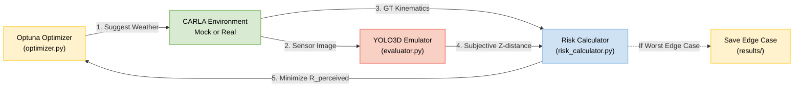

# CARLA Edge Case Search & Active Learning Pipeline

This project is a pipeline designed to automatically identify **"edge cases" (adverse weather conditions)** where the recognition accuracy of autonomous driving AI declines. By using an efficient search algorithm (Optuna), it discovers critical scenarios where the AI mistakenly perceives a dangerous situation as safe.

Currently, functionality can be verified using an image-processing-based mock environment (`carla_mock.py`) with a **YOLO3D Emulator** built on top of YOLOv8. In the future, this pipeline will be extended into an **Active Learning Loop**, where the discovered edge cases are automatically used to retrain and improve the AI model.

---

## 🏗️ Pipeline Architecture

The pipeline calculates the **Perceived Risk ($R_{perceived}$)** by comparing Ground Truth (GT) kinematics with the AI's subjective perception (YOLO3D Z-distance). Optuna **minimizes** this risk score to find the most dangerous edge cases (e.g., scenarios where GT is highly dangerous but the AI fails to detect it, resulting in a low perceived risk).



### 🧮 The Perceived Risk Formula
The `RiskCalculator` computes how dangerous a situation is perceived by the AI:

$$ R_{perceived} = K \times \frac{\omega \cdot \mu \cdot \alpha \cdot \beta}{\hat{r}^2 + \epsilon} + C $$

- **$\omega$ (Interaction Weight)**: Are we approaching the target? (1.0 for approaching, 0.1 for separating).
- **$\mu$ (Class Factor)**: Danger coefficient based on object class (e.g., Pedestrian=1.5, Truck=1.2).
- **$\alpha$ (Speed Amplification)**: Exponentially increases based on the closing speed.
- **$\beta$ (Lateral Attenuation)**: Exponentially decreases if the object is not directly in the ego vehicle's path.
- **$\hat{r}$ (YOLO3D Z-distance)**: The AI's *subjective* estimation of the object's distance. If detection fails, $\hat{r} = \infty$, making $R_{perceived}$ approach 0 (AI incorrectly thinks it is perfectly safe).

---

## 🚀 How to Run the Pipeline (For Team Members)

We have provided wrapper scripts to make it easy for anyone on the team to run the pipeline and generate results.

### 1. Prerequisites
Ensure you have Python 3.8+ installed.

### 2. Run the Optimization
Simply execute the provided script for your OS. It will automatically install dependencies and start the Optuna search loop.

**For Windows:**
```cmd
run_pipeline.bat
```

**For Linux / macOS:**
```bash
bash run_pipeline.sh
```

### 3. Review the Results
Once the pipeline finishes, check the `results/` directory:
- **`edge_case_worst_TPE.jpg`**: The image where the AI failed the hardest (lowest perceived risk in a dangerous situation).
- **`edge_case_best_TPE.jpg`**: The image where the AI detected the object perfectly.
- **`history_tpe.csv`**: A full log of all trials, weather parameters, GT data, and calculated risk scores.

---

## 📁 Project Structure
- `optimizer.py`: The main Optuna execution loop.
- `risk_calculator.py`: Contains the Perceived Risk mathematical formula.
- `evaluator.py`: Emulates YOLO3D depth perception using YOLOv8 bounding boxes.
- `carla_mock.py`: A mock environment applying weather effects to `base_image.png`.
- `carla_real_template.py`: Code template for integrating with the actual CARLA simulator.
- `results/`: Directory where edge case images and CSV histories are saved.

---

## 🤝 Integrating with the Real CARLA Simulator

For detailed instructions on how to transition from the mock environment to a live CARLA simulation, please refer to our:

👉 **[CARLA Integration Guide](CARLA_INTEGRATION_GUIDE.md)**

### Quick Summary:
1. **Install CARLA**: Download from the [official CARLA website](https://carla.org/).
2. **Implement Connection**: Use `carla_real_template.py` to create a class that fetches live camera sensors and ground truth data.
3. **Swap Environments**: In `optimizer.py`, replace `MockCarlaEnv` with your new CARLA environment class.
