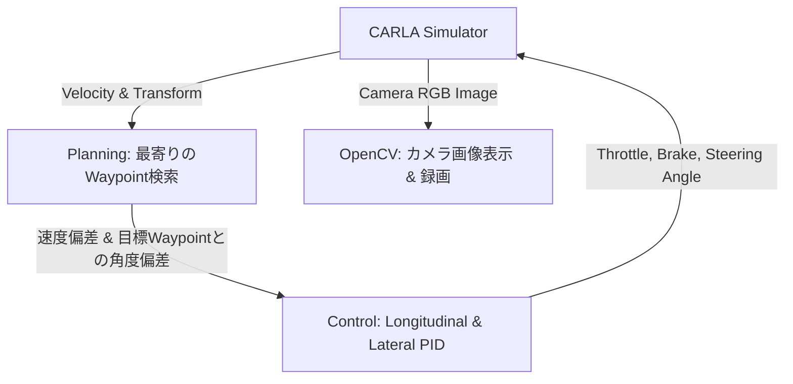

# 自動運転制御レポート：CARLAシミュレータにおける純粋なPID操舵・速度制御とチューニングガイド

本ドキュメントは、Gitリポジトリをクローンした開発チームメンバーが、自身のPC環境でCARLAシミュレータに接続し、縦方向（車速）および横方向（ステアリング）の**PID制御**を調整（チューニング）するための手順と基本設計をまとめたレポートです。

本プロジェクトの `week3-week4` フォルダ内は、AI関連の重いライブラリ（PyTorch等）への依存は一切排除されており、純粋なPID制御制御ロジックのみで構成されているため、どのPC環境でも軽量に動作します。

---

## 1. 制御システムアーキテクチャ

本制御システムは、シミュレータ同期モード（20 FPS, dt=0.05s）で動作し、車両の物理状態に基づいてアクセル・ブレーキ・ステアリングをフィードバック制御します。



- **縦方向制御 (速度制御)**: 
  目標速度と現在の車速の偏差 $e_v = v_{\text{target}} - v$ から、スロットル/ブレーキ量（出力: $-8.0$ m/s² 〜 $+4.0$ m/s² 相当）を計算します。
- **横方向制御 (操舵制御)**: 
  車両前方の目標ウェイポイントに対するヨー角のズレ $e_{\psi}$（Planningが算出）から、ステアリング角度指令（出力: $-1.0$ 〜 $+1.0$）を計算します。

---

## 2. 積分ワインドアップ対策（アンチワインドアップ）

物理的なペダル踏み込み量（0〜1）やステアリング最大切れ角には制限があります。急加速時や大きな旋回時にPIDの積分項が過剰に溜まってしまう現象を防ぐため、`carla_pid_controller.py` には**積分値のクランプ処理**を実装しています。

```python
# 横方向のクランプ例
if self.lat_ki != 0.0:
    max_lat_int = 1.0 / self.lat_ki
    self.lat_integral = max(-max_lat_int, min(max_lat_int, self.lat_integral))
```
これにより、目標値到達直後に逆方向への大きなはみ出し（オーバーシュート）が発生するのを防止し、車線キープを安定させています。

---

## 3. クローン後の接続・実行手順（他PCでの実行用）

リポジトリをGitクローンした他のPCで接続を検証する手順です。

### 3-1. 必要ライブラリのインストール
Python環境で、数値計算と描画に必要な最小限のパッケージをインストールします。

```bash
# AI関連ライブラリは不要です
pip install numpy opencv-python matplotlib

# CARLAのPython API（実行環境のCARLAのバージョンに合わせる。例: 0.9.15）
pip install carla==0.9.15
```

### 3-2. CARLAの起動
お使いのPCでCARLAシミュレータ本体を起動します。GPUへの負荷を最小限に抑えるため、「Low品質モード」での起動を推奨します。

- **Windowsの場合**:
  ```bash
  CarlaUE4.exe -quality-level=Low
  ```

### 3-3. 制御プログラムの起動 (`carla_integration_demo.py`)
`week3-week4` ディレクトリに移動し、コマンドラインから接続先やPIDパラメータを指定して実行します。

#### ① ローカルPCのCARLAに接続する場合
```bash
python carla_integration_demo.py
```

#### ② 別のPCで動いているCARLAにリモート接続する場合
```bash
python carla_integration_demo.py --host 192.168.X.X --port 2000
```

---

## 4. コマンドラインからのPIDパラメータ調整手順

ソースコードを書き換えることなく、コマンド引数で異なるパラメータ特性をテストできます。

### ① Tuned (適切に調整され、滑らかに車線キープする設定)
適度な比例制御(P)と、首振りを効果的に抑える微分制御(D)により、ガクつきのない走行を実現します。
```bash
python carla_integration_demo.py --kp-lat 0.25 --kd-lat 0.35 --kp-lon 1.5 --kd-lon 0.1
```

### ② Oscillating (過敏なP設定：小刻みな急ハンドルを繰り返す)
D（減衰）が不足し、P（バネの強さ）が高すぎるため、車線中心を行き過ぎて小刻みに蛇行します。
```bash
python carla_integration_demo.py --kp-lat 0.8 --kd-lat 0.01
```

### ③ Sluggish (鈍感な設定：曲がりきれずにコースアウトする)
ゲインが全体的に不足しているため、車線中心から外れてもステアリング修正が間に合いません。
```bash
python carla_integration_demo.py --kp-lat 0.05 --kd-lat 0.0
```

---

## 5. 自動ログ評価と可視化ファイルについて

実行中にターミナルで **`Ctrl+C`** を押してプログラムを終了すると、クリーンアップ完了後、以下の解析結果が `week3-week4` フォルダ内に自動保存されます。

1. **走行評価グラフ: `carla_pid_tuning_results.png`**
   - 速度追従性、横方向ズレ量（CTE: Cross-Track Error）、ステアリング指令の変動、加減速（スロットル・ブレーキ）入力をプロットしたグラフです。
   - 走行ラインにガタつきがないか、CTEが素早く0に収束しているかを定量評価できます。
2. **走行録画動画: `carla_run_recording.avi`**
   - 走行中の前面カメラ画像と、車速・CTE・ステア指令値をオーバーレイした走行動画です。
   - 車両の揺れやカクつきを目視でレビューすることができます。
